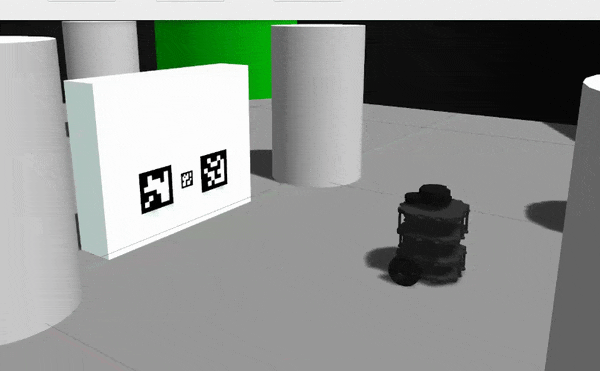
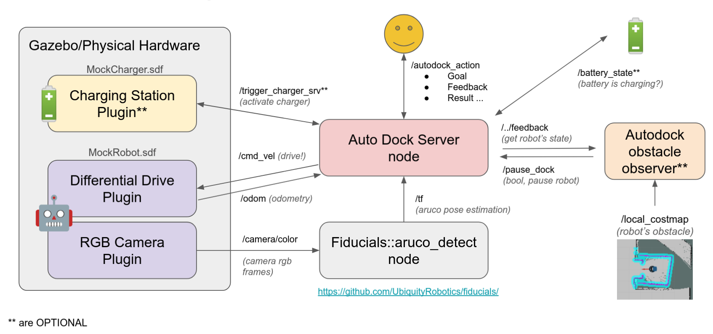
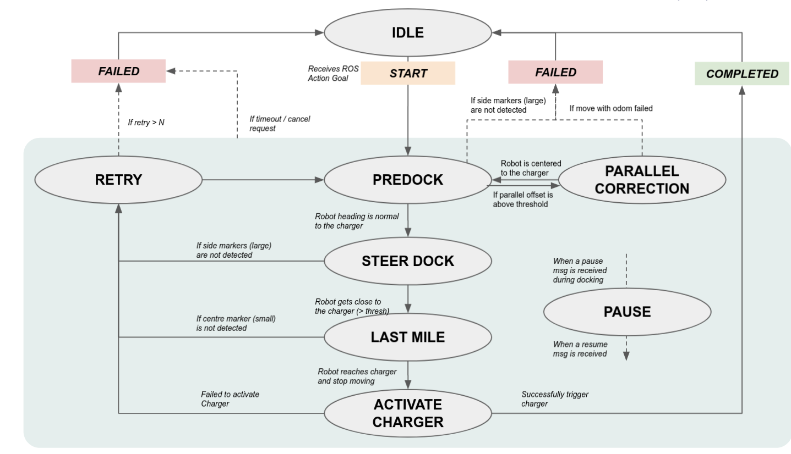

# autodock


ROS packages for automatic docking

`autodock` a state machine based auto docking solution for differential-drive robot,
allows accurate and reliable docking. It utilizes 3 fiducial markers to locate the 
position of the docking station. Hence, the Robot should equip with a camera input
for fiducial marker detection. Note that, this package works on top of the navigation 
stack, not making any alteration to the robot's nav stack. The solution is fully
tested on multiple simulated and actual robots.

 

Packages:
 - `autodock_core`: Core autodock scripts and lib
 - `autodock_examples`: Examples for autodock
 - `autodock_sim`: Autodock Simulation

## Installation

[ROS Noetic](http://wiki.ros.org/noetic/Installation/Ubuntu) is used during development.

Dependencies
 - [Fiducial](https://github.com/UbiquityRobotics/fiducials)
 - [Turtlebot Simulation](http://wiki.ros.org/turtlebot3_simulations) ** Optional

```bash
# First, clone repos and deps to 'catkin_ws/src', then install
cd catkin_ws
rosdep update && rosdep install --from-paths src --ignore-src -yr
catkin_make
```
## Architecture Diagram



## State Machine Diagram



---

## Run Examples on Simulation with MockRobot

Run `MockRobot` in gazebo world
```bash
roslaunch autodock_sim dock_sim.launch
```

try to send an action goal request
```bash
rostopic pub /autodock_action/goal autodock_core/AutoDockingActionGoal {} --once
```

Now you will see the robot starts to execute a series of autodocking sequence.

> To explain..... when an action goal `AutoDockingActionGoal` is received by the robot, 
the robot will start to docking sequence. When it manages to reach the targer 
docking station, it will send a `std_srvs/Trigger` to the `MockCharger` charging 
station, to activate the charger. The charger will validate if the robot is docked, 
then send a "Success" back to the robot if all goes well.
Subsequently, end the entire docking action.

```bash
# To remote control the robot: 
rosrun teleop_twist_keyboard teleop_twist_keyboard.py
# To cancel an active docking action: 
rostopic pub /autodock_action/cancel actionlib_msgs/GoalID {} --once
# To pause an active docking action: 
rostopic pub /pause_dock std_msgs/Bool True --once
```

### More Tests

This simple smoke test script will randomly move the robot to some random position 
in the gazebo world, and initiate the docking sequence.

```bash
# indicate the number of "spawn" with the -c arg
rosrun autodock_examples dock_sim_test.py -c 10
```

---

## Run with turtlebot3

This demonstrates front dock with turtlebot3, attached with a front camera. 
A smaller docking station is used here.

 - dependency: `sudo apt install ros-noetic-turtlebot3-gazebo`

```bash
roslaunch autodock_sim tb3_dock_sim.launch
rostopic pub /autodock_action/goal autodock_core/AutoDockingActionGoal {} --once
```

---

## Run Turtlebot3 with navigation

This demo depends on [turtlebot3_simulation](https://github.com/ROBOTIS-GIT/turtlebot3_simulations) 
and [move_base](http://wiki.ros.org/move_base). 
Please ensures that you have all dependencies are fully installed.

> Note: You can install all turtlebot simulation related packages by 
`sudo apt install ros-noetic-turtlebot3*`, or follow the setup steps in
[Robotis docs](https://emanual.robotis.com/docs/en/platform/turtlebot3/simulation/). 
Once done, continue to follow the steps to launch and map the world with a `burger` robot.

Please ensures that entire pipeline of the turtlebot works before proceeding with the 
autodock tb3 demo below. Once done with mapping, you can start with the `autodock` simulation:

```bash
# 1. launch turtlebot3 gazebo world, and also autodock_server
roslaunch autodock_sim tb3_nav_dock_sim.launch

# 2. launch navigation stack, with provided map. You can also remap the environment by following the turtlebot sim tutorial
## New Terminal
export TURTLEBOT3_MODEL=burger
roslaunch turtlebot3_navigation turtlebot3_navigation.launch map_file:=$HOME/catkin_ws/src/autodock/autodock_sim/maps/map.yaml open_rviz:=0
```

Now, localize the robot and move the robot with rviz.
Move the robot as such that the camera is facing the charging station.
```bash
# 3. send a dock action. make sure that the robot's camera is facing the charger
## New Terminal
rostopic pub /autodock_action/goal autodock_core/AutoDockingActionGoal {} --once
```

This will also demonstrate how the simple `obstacle_observer` works. 
Try place an obstacle near the robot during docking and see if it pauses.

> Note: the current `obstacle_observer` will only `pause` if it is 
in `predock`, `steer_dock`, or `parralel_correction` state.

---

### Docker Container

A docker file is provieded to buid a container for autodock. Follow these steps:

```bash
cd catkin_ws/src/autodock
docker build -t osrf/autodock:v1 .
docker run -it --network host osrf/autodock:v1 bash -c "$COMMAND"
```

---

## Notes

> The initial development of this code was graciously supported by [Kabam Robotics (aka Cognicept)](https://github.com/cognicept-admin).

### Future Work
 - Advance `ObstacleObserver`: filter occupancy of charging station on costmap.

### Stray Commands 

Debug by launching autodock node on a seperate terminal
```bash
# Terminal 1
roslaunch autodock_sim dock_sim.launch autodock_server:=false

# Terminal 2, specify config.yaml with the 'autodock_config' arg
roslaunch autodock_core autodock_server.launch \
    autodock_config:=src/autodock/autodock_examples/configs/mock_robot.yaml
```
